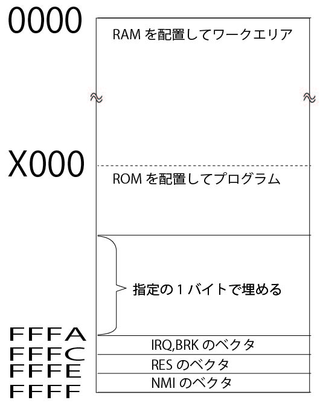

# make ROM module

## Overview
 For SystemVerilog ROM module(.sv) maker

## Description
 This index.html and makeROMmodule.js make the "ROM.sv" from the "romdata1.dat" and the "romdata2.dat". "romdata1.dat" is the 8 bit cpu's program(like 6502 binary). "romdata2.dat" is a binary array of IRQ/RES/NMI vector adcress. image"ROM.sv" is SystemVerilog program.

 

## Requirement
 index.html
 makeROMmodule.js
 makeROMmodule.css
 jquery-1.12.4.min.js

## Usage
 1. Access http://openpne.sakura.ne.jp/makeROMmodule/
 2. Select the local dat failes.
 3. Click the [make] button.
 4. Download the sv file.

## Install
 Copy ４ files to your folder(directory). It does't need the server.

## Licence

## Author

[landm](https://github.com/landm2000)
